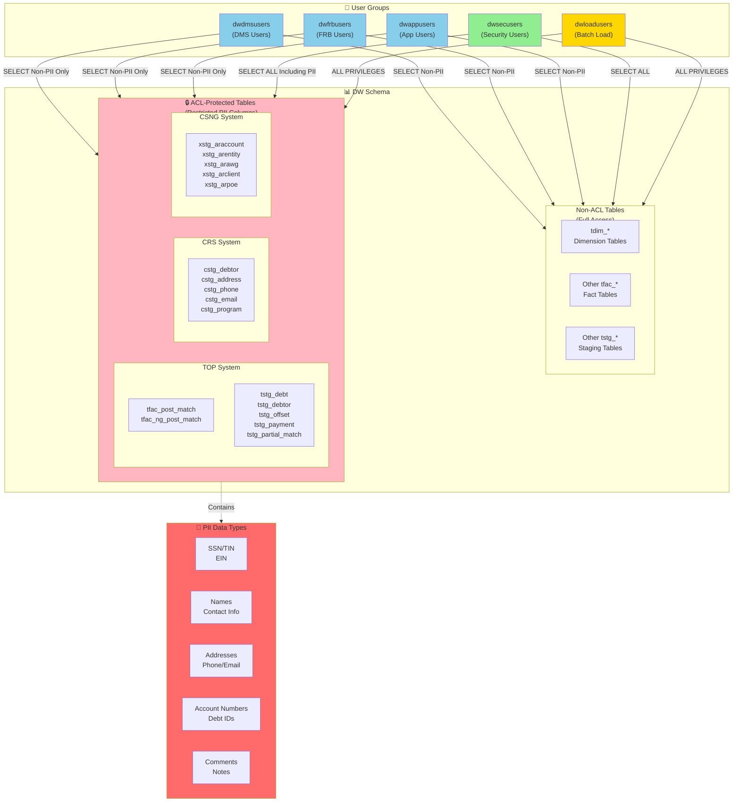
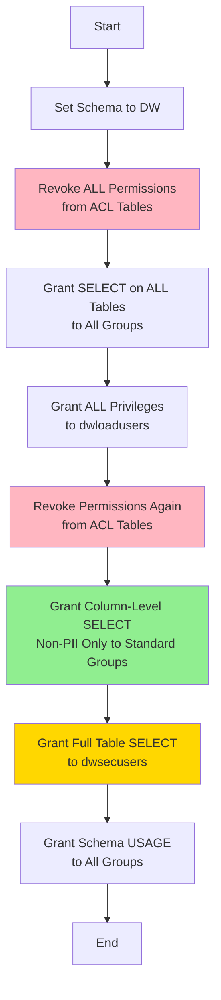

# DDMAP Data Warehouse Permissions with ACL

**Disbursement and Debt Management Analytics Platform (DDMAP)**

## Overview

This SQL script manages table-level and column-level permissions for the DDMAP Data Warehouse in Amazon Redshift, implementing Access Control Lists (ACL) for Personally Identifiable Information (PII) protection.

## Purpose

- **Table-Level Permissions**: Grant SELECT access to non-PII columns for standard user groups
- **ACL Column Permissions**: Restrict PII column access to authorized security users only
- **Compliance**: Ensure data privacy and security compliance for sensitive financial and personal data

## Architecture Diagram

## User Groups & Access Levels

| Group | Description | Access Level |
|-------|-------------|--------------|
| **dwsecusers** | Security administrators | Full access to ALL columns including PII |
| **dwloadusers** | Batch ETL processes | Full privileges (INSERT, UPDATE, DELETE, SELECT) |
| **dwdmsusers** | DMS application users | SELECT on non-PII columns only |
| **dwfrbusers** | FRB application users | SELECT on non-PII columns only |
| **dwappusers** | General application users | SELECT on non-PII columns only |

## ACL-Protected Tables

### TOP System Tables (Treasury Offset Program)
- `tfac_post_match` - Post-match fact table
- `tfac_ng_post_match` - Next generation post-match
- `tstg_debt` - Debt staging
- `tstg_debtor` - Debtor information
- `tstg_offset` - Offset transactions
- `tstg_payment` - Payment records
- `tstg_partial_match` - Partial match records
- `tstg_non_offset_payment` - Non-offset payments
- `tstg_creditor_agency` - Creditor agency data
- `tstg_top_user` - TOP user information

### CRS System Tables (Cross-Servicing)
- `cstg_debtor` - Debtor master
- `cstg_address` - Address information
- `cstg_phone` - Phone numbers
- `cstg_email` - Email addresses
- `cstg_program` - Program details
- `cstg_incomingpayment` - Payment transactions
- `cstg_debtorindividualmaster` - Individual debtor details
- `cstg_debtorbusinessmaster` - Business debtor details
- `cstg_financialanalysisindividual` - Financial analysis
- `cstg_issue` - Issue tracking

### CSNG System Tables (Collection System Next Generation)
- `xstg_araccount` - Account records
- `xstg_arentity` - Entity information
- `xstg_arawg` - Administrative Wage Garnishment
- `xstg_arclient` - Client data
- `xstg_arpoe` - Place of Employment
- `xstg_arphone` - Phone records
- `xstg_arrelationship` - Relationship data
- `xstg_stuser` - System user information

## PII Column Types Protected

### Identity Information
- SSN (Social Security Number)
- TIN (Taxpayer Identification Number)
- EIN (Employer Identification Number)
- Date of Birth
- DUNS Number

### Contact Information
- Names (First, Last, Middle)
- Email addresses
- Phone numbers (with extensions)
- Fax numbers

### Address Information
- Street addresses (lines 1-6)
- City, State, ZIP
- Country

### Financial Information
- Account numbers
- Routing numbers
- Debt agency account IDs
- Billing account numbers

### Sensitive Notes
- Comments and notes fields
- Hearing notes
- Dispute information
- Resolution explanations

## Script Workflow

## Execution Steps

1. **Set Schema**: `SET SEARCH_PATH TO DW;`

2. **Initial Revoke**: Remove existing ACL permissions before global grants

3. **Global Grants**: 
   - Grant SELECT on all tables to read-only groups
   - Grant ALL privileges to batch load group

4. **ACL Revoke**: Remove global permissions from ACL-protected tables

5. **Column-Level Grants**: 
   - Grant SELECT on specific non-PII columns to standard groups
   - Grant full table SELECT to security group

6. **Schema Usage**: Grant schema usage to all groups

## Version History

| Version | Date | Author | Changes |
|---------|------|--------|---------|
| v17 | 12/03/2021 | Rosa Chan | Changed `tstg_partial_match.top_name_control_val` to ACL column |
| v16 | 10/26/2021 | Rosa Chan | Removed 20 obsolete xstg tables |
| v15 | 09/16/2021 | Rosa Chan | Added CRS 2021 Oct Release - Program.ProgramEIN |
| v14 | 07/13/2021 | Rosa Chan | Added CRS 2021 July Release - 6 new columns + IssueResolution |
| v13 | 07/11/2021 | Rosa Chan | Added 180 ACL columns for CSNG de-identification |
| v1-v12 | 2020-2021 | Rosa Chan | Initial development and incremental updates |

## Maintenance Requirements

### When to Run This Script

- **New Table Added**: Any time a new table is created in the DW schema
- **Table Modified**: When columns are added/removed from existing tables
- **New ACL Column**: When a column is identified as containing PII
- **User Group Changes**: When new user groups are created or permissions change

### Important Notes

1. **Superuser Required**: This script requires Redshift superuser privileges
2. **Production Impact**: Running this script will temporarily affect user access
3. **Testing**: Always test in DEV environment before production deployment
4. **Backup**: Document current permissions before making changes
5. **Coordination**: Coordinate with application teams before execution

## Security Best Practices

### Column-Level Security
- Only non-PII columns are explicitly granted to standard user groups
- PII columns are accessible only to `dwsecusers` group
- All column grants are explicitly listed (no wildcards)

### Principle of Least Privilege
- Standard users: Read-only access to non-sensitive data
- Security users: Full read access for auditing and compliance
- Batch users: Full privileges for ETL operations only

### Audit Trail
- All permission changes are version controlled
- Change history documented in script header
- Regular access reviews recommended

## Compliance Considerations

### Data Privacy Regulations
- **GDPR**: Restricts access to EU citizen PII
- **CCPA**: California Consumer Privacy Act compliance
- **FCRA**: Fair Credit Reporting Act requirements
- **GLBA**: Gramm-Leach-Bliley Act for financial data

### PII Protection
- SSN/TIN data encrypted and access-restricted
- Financial account information protected
- Contact information limited to authorized users
- Audit logs maintained for compliance reporting

## Troubleshooting

### Common Issues

**Issue**: Permission denied errors after script execution
- **Solution**: Verify user is member of correct group using `SELECT * FROM pg_group;`

**Issue**: ACL columns still accessible to standard users
- **Solution**: Ensure REVOKE statements executed before column-level grants

**Issue**: New table not accessible
- **Solution**: Re-run script to include new table in global grants

**Issue**: Batch jobs failing with permission errors
- **Solution**: Verify `dwloadusers` group has ALL privileges

## Related Documentation

- [Amazon Redshift Column-Level Access Control](https://docs.aws.amazon.com/redshift/latest/dg/r_GRANT.html)
- [DDMAP Data Dictionary](../docs/data-dictionary.md)
- [DDMAP Security Policy](../docs/security-policy.md)
- [Redshift User Management](../docs/user-management.md)

## Contact Information

**Script Owner**: Jorge Reyes (DAAB.BSSD@fiscal.treasury.gov)  
**Created**: 05/19/2020  
**Last Updated**: 12/03/2021 (v17)

## File Information

- **Filename**: `DWPermissionswithACL_12032021_v17.sql`
- **Location**: `C:\Temp\Redshift\ACL\`
- **Size**: ~200KB
- **Tables Affected**: 60+ tables with ACL protection
- **PII Columns Protected**: 500+ columns across all systems
